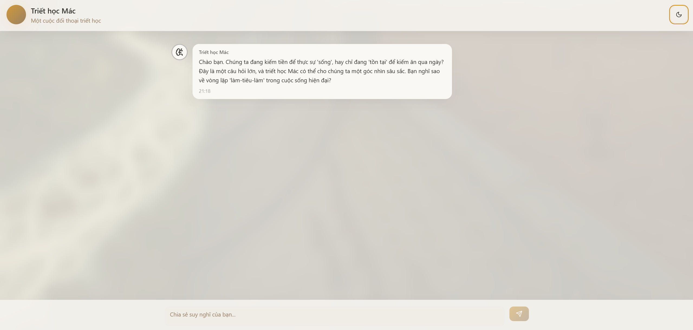

# Hướng dẫn viên Triết học Mác - Lênin

Đây là một dự án chatbot chuyên sâu, được thiết kế như một **hướng dẫn viên triết học** tập trung vào một chủ đề cốt lõi: **Sự khác biệt giữa "Sống" và "Tồn tại" qua lăng kính của triết học Mác - Lênin.**

Thay vì là một cỗ máy trả lời, chatbot này đóng vai trò là một người bạn đồng hành, sử dụng phương pháp Socratic để đặt những câu hỏi gợi mở, giúp người dùng (đặc biệt là người trẻ) tự suy ngẫm về ý nghĩa của lao động, tiền bạc và sự phát triển bản thân trong xã hội hiện đại.

Dự án được xây dựng trên kiến trúc RAG (Retrieval-Augmented Generation), với toàn bộ quá trình vector hóa kiến thức được thực hiện **hoàn toàn local**, đảm bảo tính riêng tư và hiệu quả.



---

### ✨ Mục tiêu & Tính năng

*   **Mục tiêu chính:** Giúp người dùng khám phá chủ đề "Sống vs. Tồn tại", vận dụng lý thuyết Mác - Lênin về bản chất con người và sự tha hóa lao động để phân tích các vấn đề của xã hội đương đại.
*   **Tương tác Socratic:** Chatbot dẫn dắt cuộc trò chuyện bằng các câu hỏi kiến tạo, khuyến khích tư duy phản biện thay vì cung cấp câu trả lời một chiều.
*   **Retrieval-Augmented Generation (RAG):** Câu trả lời được tạo ra dựa trên cơ sở kiến thức từ các tài liệu Mác - Lênin được cung cấp, đảm bảo tính chính xác và chiều sâu học thuật.
*   **Local Embeddings:** Sử dụng `@xenova/transformers` để chạy model embedding `Xenova/all-MiniLM-L6-v2` ngay trên máy, không cần gọi API ngoài.
*   **Kiến trúc Client-Server:** Tách biệt giao diện (React) và logic xử lý (Node.js/Express) để tối ưu hiệu năng và bảo mật.
*   **Streaming Responses:** Câu trả lời được hiển thị dần dần (hiệu ứng gõ chữ), mang lại trải nghiệm đối thoại tự nhiên và mượt mà.
*   **Cơ sở dữ liệu Vector bền vững:** Sử dụng ChromaDB chạy trên Docker với Docker Volumes để lưu trữ kiến thức lâu dài.
*   **Cập nhật kiến thức tăng cường:** Script thông minh cho phép nạp thêm tài liệu mới mà không cần xử lý lại toàn bộ dữ liệu cũ.

### 🛠️ Công nghệ sử dụng

*   **Frontend:** React, Vite, TypeScript, TailwindCSS
*   **Backend:** Node.js, Express.js
*   **AI & RAG:**
    *   **LLM:** Google Gemini API (ví dụ: `gemini-1.5-pro`)
    *   **Local Embeddings:** `@xenova/transformers`
    *   **Vector Database:** ChromaDB
*   **Môi trường:** Docker

### 🏛️ Sơ đồ kiến trúc

```
+----------------+      (1) Gửi câu hỏi      +-----------------+      (3) Vector hóa, tìm kiếm      +----------------+
|                | ------------------------> |                 | --------------------------------> |                |
|  React (Client)  |                           |  Node.js (Server) |                                   |  ChromaDB (DB) |
|                | <------------------------ |                 | <-------------------------------- |                |
+----------------+   (7) Stream câu trả lời   +-----------------+     (4) Lấy context           +----------------+
                                                      |
                                                      | (5) Gửi prompt bổ sung
                                                      v
                                              +----------------+
                                              |                |
                                              | Google Gemini  |
                                              |      API       |
                                              |                |
                                              +----------------+
                                                      ^
                                                      | (6) Stream câu trả lời về
                                                      |
```

---

### 🚀 Bắt đầu

Để chạy dự án này trên máy của bạn, hãy làm theo các bước sau.

#### 1. Yêu cầu tiên quyết

*   [Node.js](https://nodejs.org/) (phiên bản v18 trở lên)
*   [npm](https://www.npmjs.com/) (thường đi kèm với Node.js)
*   [Docker Desktop](https://www.docker.com/products/docker-desktop/)

#### 2. Cài đặt

1.  **Clone repository:**
    ```bash
    git clone https://github.com/LeMinhHung2801AI/chatbot-marxism-leninism.git
    cd chatbot-marxism-leninism
    ```

2.  **Cài đặt các gói phụ thuộc:**
    ```bash
    npm install
    ```

3.  **Thiết lập biến môi trường:**
    *   Sao chép file `.env.example` thành một file mới tên là `.env.local`.
        ```bash
        cp .env.example .env.local
        ```
    *   Mở file `.env.local` và thay thế `"YOUR_API_KEY_HERE"` bằng Google Gemini API key của bạn.

4.  **Chuẩn bị tài liệu kiến thức:**
    *   Tạo một thư mục tên là `documents` ở gốc dự án.
    *   Sao chép các file `.pdf` và `.docx` về triết học Mác - Lênin vào thư mục `documents` này.

#### 3. Chạy ứng dụng

Để hệ thống hoạt động đầy đủ, bạn cần chạy **3 tiến trình chính** trong **3 cửa sổ terminal riêng biệt**.

**Terminal 1: Khởi động Database Vector (ChromaDB)**
Lệnh này sẽ khởi động container Docker và tạo một thư mục `chroma-data` để lưu trữ dữ liệu lâu dài.
```bash
docker run -p 8000:8000 -v ./chroma-data:/data chromadb/chroma
```

**Terminal 2: Khởi động Backend Server**
Server này sẽ xử lý logic RAG và giao tiếp với Gemini API.
```bash
npx ts-node --project tsconfig.cjs.json server.cts
```
Bạn sẽ thấy thông báo `Backend server is running at http://localhost:3001`.

**Terminal 3: Khởi động Frontend App**
Đây là giao diện người dùng React.
```bash
npm run dev
```
Mở trình duyệt và truy cập vào URL mà Vite cung cấp (thường là `http://localhost:8080` hoặc `http://localhost:5173`).

#### (Tùy chọn) Terminal 4: Nạp/Cập nhật dữ liệu vào Database
Bạn chỉ cần chạy script này trong hai trường hợp:
*   **Chạy lần đầu tiên** để nạp dữ liệu ban đầu.
*   **Chạy lại mỗi khi bạn thêm file mới** vào thư mục `documents`.
```bash
npx ts-node --project tsconfig.cjs.json scripts/ingest.cts
```

Bây giờ bạn đã có thể bắt đầu cuộc đối thoại triết học của mình!